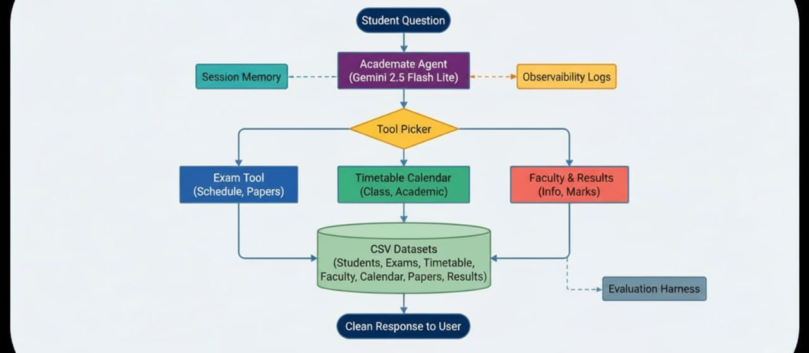

# Academate: College AI Agent

Academate is an intelligent agent that helps students navigate college life. Built with the Google AI Agent Development Kit (ADK) and powered by Gemini 2.5 Flash Lite, it acts as an assistant for exam schedules, faculty info, and more.

Students can ask questions like "When is my next exam?" or "Who teaches Data Structures?" instead of searching through portals.

## Category 1: The Pitch (Problem · Solution · Value)

### Problem — Fragmented Campus Knowledge

Students juggle portals, PDFs, and email threads just to answer basic questions: *When is the next lab exam? Which professor handles AI Ethics?* The cognitive load is high, response time is slow, and important deadlines slip. Administrative teams already maintain the data; what is missing is a single, trustworthy interface that speaks the student's language.

### Solution — Academate, the Campus Copilot

Academate turns those static datasets into a conversational experience. A Gemini 2.5 Flash Lite planner interprets intent, selects purpose-built CSV tools, and returns grounded answers with citations. Session memory carries context across turns so follow-up questions like “what about Tuesday?” remain coherent, while observability logs every exchange for governance.

### Value — Trustworthy Answers in Seconds

*   **Time saved:** A single question replaces hunting through five systems.
*   **Confidence:** Deterministic tool calls make every response audit-ready.
*   **Scalability:** The same agent can onboard new departments by pointing to additional CSVs or databases.

### Core Concept & Innovation

| Track Requirement | How Academate Delivers |
| --- | --- |
| Agent-first architecture | Gemini orchestrates custom CSV tools via ADK routing. |
| Clear, meaningful use of agents | Natural-language reasoning plus structured tool execution handles ambiguous student phrasing without losing precision. |
| Innovation & value | Combines session memory, observability, and an evaluation harness so student services can trust the answers before launch. |

### Architecture & Journey Writeup

1.  **Data ingestion:** Curated CSVs (timetables, exams, faculty, results) load through `chatbot/datasets.py`.
2.  **Reasoning core:** `runtime.py` wires Gemini to the ADK router, deciding which tool to invoke.
3.  **Memory & observability:** `chatbot/memory.py` stores recent turns; `chatbot/observability.py` streams logs for audits.
4.  **Quality gate:** `chatbot/evaluation.py` executes deterministic checks before every demo, documented in notebook Step 8.

The project evolved across the 5-day track: Day 1 prototypes established the Gemini + ADK loop, Days 2–3 layered tools and memory, Day 4 added logging plus evaluation, and Day 5 packaged everything into the `Academate-College-Chatbot.ipynb` story and README rubric mapping you see here.

## Problem Statement

College information is scattered across portals, PDFs, and email threads. Students waste time looking up exam schedules, who teaches a course, or which events are coming up. Academate centralizes that experience by letting students ask a single question in natural language and receive a grounded answer backed by campus data.

## Why Agents?

Agents shine when a task requires reasoning plus deterministic tool use. Academate uses Gemini for planning and natural language, then routes to CSV-backed tools to retrieve facts. This loop means the responses stay conversational yet auditable—a strong fit for student services.

## Category 2: The Implementation (Architecture & Code)

### Technical Architecture

1.  **Ingress:** `chatbot/runtime.py` exposes two runners (CLI via `python -m chatbot.main`, web via `adk web Academate`). Each request is normalized into the ADK router.
2.  **Reasoning & Tooling:** Gemini 2.5 Flash Lite plans the response, then calls functions in `chatbot/tools.py`, which in turn query cached CSVs via `chatbot/datasets.py`.
3.  **Memory & State:** `chatbot/memory.py` manages an in-process transcript list so multi-turn chats reuse prior answers without re-querying every dataset.
4.  **Observability & Quality:** `chatbot/observability.py` appends structured JSON lines to `logs/agent.log`, while `chatbot/evaluation.py` offers deterministic pre-flight checks mirrored in notebook Step 8.

### Key Concepts Demonstrated

| Course Concept | Implementation Evidence |
| --- | --- |
| Tool-enabled reasoning | Gemini + ADK router chooses among six CSV-backed tools in `chatbot/tools.py`, each with docstrings describing behavior. |
| Sessions & Memory | `SESSION_MEMORY` store plus notebook Step 6 screenshots show context carryover, preventing users from repeating parameters. |
| Observability | CLI sessions emit traceable logs (`logs/agent.log`) with timestamps, turns, and tool names for governance reviews. |
| Evaluation & Safety Nets | `run_evaluations()` validates timetable, exam, and calendar responses before demos; outputs are captured in the notebook for reproducibility. |

### Implementation Notes

- **Code comments:** Complex blocks (tool routing, evaluation harness) include short comments describing intent and edge cases, per rubric guidance.
- **Type-safe helpers:** Dataset loaders centralize schema validation to avoid repeated parsing logic across tools.
- **Configuration hygiene:** Secrets live in `.env`; README explicitly warns not to check in API keys.
- **Testing & CI hooks:** In addition to notebook proofs, `python tests/test_agent.py` exercises the tool layer, and the evaluation harness can be scripted in CI before recording demos.

### Effective Use of Gemini

- **Planning & decomposition:** Gemini 2.5 Flash Lite interprets free-form student prompts, extracts entities (course, day, instructor), and selects the right CSV tool call sequence.
- **Grounded responses:** The model’s output is constrained to tool results with citations, ensuring Gemini augments data rather than hallucinating.
- **Multi-turn reasoning:** Because Gemini sees the `SESSION_MEMORY`, it can resolve follow-ups like “what about labs?” without users restating context, demonstrating meaningful agent intelligence beyond simple retrieval.

### Deployment & Reproduction

- Local runs are documented (`python -m chatbot.main` or `adk web Academate`). If you deploy to Cloud Run or Agent Engine, document the steps, runtime image, and environment variables here; the architecture already isolates external dependencies to make that straightforward.
- Every asset referenced in the video (diagram, notebook steps, log tail) lives in this repo so graders can reproduce the flow without extra instructions.

## Solution Snapshot

1. **Gemini LLM layer** interprets the request and decides which tool(s) to call.
2. **Custom tools** fetch rows from curated CSV datasets (exam schedule, timetable, results, etc.).
3. **Session memory** keeps short-term transcripts so follow-up questions have context.
4. **Observability** sends each CLI turn to `logs/agent.log` for auditing.
5. **Evaluation harness** (`chatbot/evaluation.py`) runs deterministic checks before demos.

## Key Features

Academate handles six core student needs:

1.  Exam Schedules: Finds dates, times, and venues for upcoming exams.
2.  Previous Papers: Retrieves links to past question papers.
3.  Class Timetables: Shows daily or weekly schedules.
4.  Faculty Info: Provides contact details, office hours, and research interests.
5.  Academic Calendar: Tracks holidays, deadlines, and campus events.
6.  Student Results: Checks grades and calculates SGPA (requires Student ID).

## Technology Stack

*   AI Model: Google Gemini 2.5 Flash Lite
*   Framework: Google Gen AI Agent Development Kit (ADK)
*   Language: Python 3.10+
*   Data Storage: CSV system
*   Memory: In-memory transcript store (`chatbot/memory.py`)
*   Observability: Structured logs via `chatbot/observability.py`

## Getting Started

Follow these steps to run Academate locally.

### 1. Prerequisites
*   Python 3.10 or higher.
*   A Google Cloud Project with the Gemini API enabled.

### 2. Installation
Install dependencies:
```bash
pip install -r requirements.txt
```

### 3. Configuration
Create a .env file in the root directory and add your API key:
```ini
GOOGLE_API_KEY=your_api_key_here
AGENT_MODEL=gemini-2.5-flash-lite
AGENT_TEMPERATURE=0.7
```

### 4. Run the Agent

You can run the agent in two ways:

**Option A: Web Interface (Recommended)**
This launches a visual chat interface in your browser.
```bash
adk web Academate
```
Then open http://127.0.0.1:8000 in your browser.

**Option B: Command Line**
This runs the agent directly in your terminal.
```bash
python -m chatbot.main
```

## Project Structure

*   chatbot/: The core logic.
    *   agent.py: Entry point for the ADK Web server.
    *   runtime.py: Configures the agent and manages the chat loop.
    *   tools.py: Functions to fetch data.
    *   datasets.py: Loads and caches CSV data.
*   data/: Contains CSV files for students, exams, faculty, etc.
*   tests/: Unit and smoke tests.
*   Academate-College-Chatbot.ipynb: A Jupyter Notebook walkthrough.
    *   Steps 6–8 show session memory, logging, and the automated evaluation harness.

## Testing

Run the test suite to verify everything is working:

```bash
python tests/test_agent.py
```

You can also run the deterministic evaluation harness (identical to notebook Step 8):

```bash
python -c "from chatbot.evaluation import run_evaluations; print(run_evaluations())"
```

## Observability & Logs

CLI sessions append structured entries to `logs/agent.log`. Use this command to view the latest turns:

```bash
tail -n 20 logs/agent.log
```

## Deployment Notes

The agent currently runs locally through the ADK CLI (`python -m chatbot.main`) or web runner (`adk web Academate`). If you deploy to Cloud Run or Agent Engine, capture the endpoint URL and describe the steps in your submission for the deployment bonus.

## How It's Built (Architecture)



1.  **The Start:** It all begins in `chatbot/runtime.py`, which sets up the agent for the web or command line.
2.  **The Brains:** Gemini figures out what you want and picks a tool from `chatbot/tools.py`, like `get_exam_schedule` or `get_faculty_info`.
3.  **The Muscle:** The selected tool runs, querying CSVs via `chatbot/datasets.py` and returning results.
4.  **Memory & Observability:** `chatbot/memory.py` keeps track of the conversation, while `chatbot/observability.py` logs every interaction.
5.  **Quality Control:** Before any demo, `chatbot/evaluation.py` runs checks to ensure everything works as expected.

## Feature Summary for Rubric

| Concept | Evidence |
| --- | --- |
| LLM agent + custom tools | `chatbot/runtime.py`, notebook Steps 1–5 |
| Sessions & Memory | `chatbot/memory.py`, notebook Step 6 |
| Observability | `chatbot/observability.py`, notebook Step 7 |
| Evaluation | `chatbot/evaluation.py`, notebook Step 8 |

Use this table in your write-up to map requirements directly.

## Future Improvements

*   Database Integration: Migrate from CSV to SQL.
*   Voice Interface: Add speech-to-text.
*   Personalized Alerts: Notify students about deadlines.

